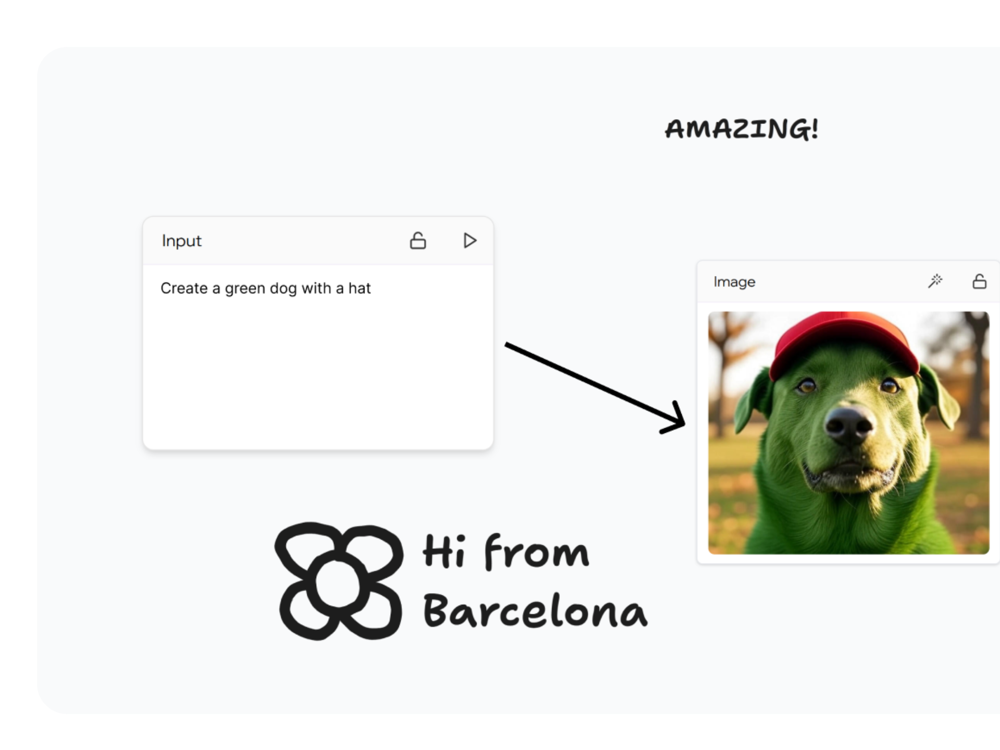

# Board



**Board** is a visual canvas where users can draw and connect custom shapes. Connected shapes share context and use an AI model to generate responses based on the combined input. The project is structured to support contextual propagation between nodes, real-time AI generation, and a clean, responsive interface.

---

## Technologies Used

- Next.js 15 (App Router)
- TypeScript
- TailwindCSS
- tldraw SDK
- OpenAI API
- Tiptap Editor
- AI SDK

---

## Installation

```bash
git clone https://github.com/mauroserralvodev/board
cd board
pnpm install
pnpm dev
```

---

## Contact & Social

mauro@brinpage.com or [mauroserralvo.com](https://mauroserralvo.com)
